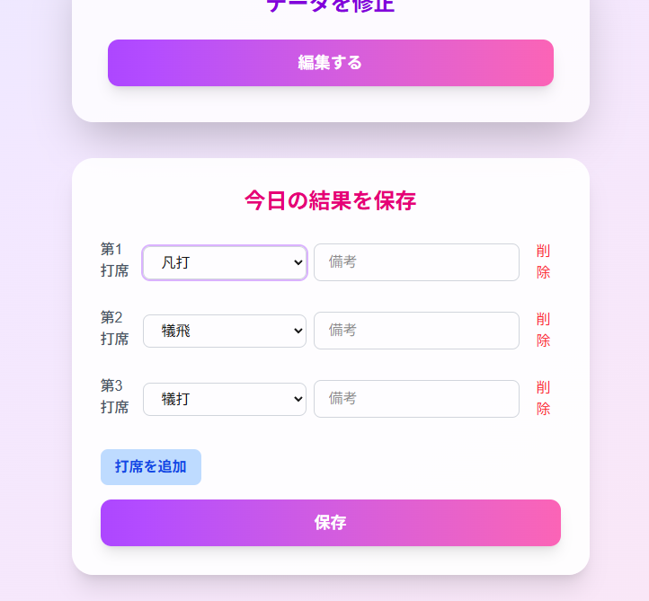
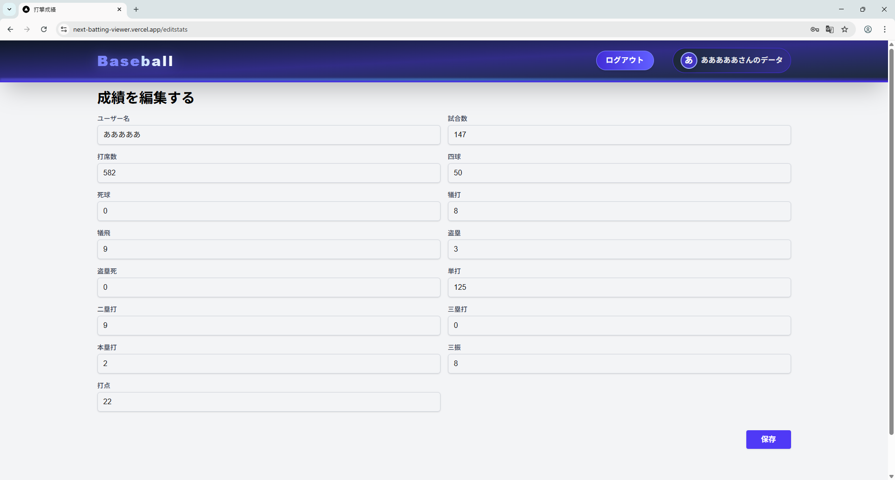

# Next-Batting-Viewer

**Next-Batting-Viewer**は、打撃成績を保存し、ランキング形式で表示するためのアプリケーションです。直感的なUIを通じて、個人の打撃データを簡単に管理・閲覧できます。

## 技術スタック

このプロジェクトは以下の技術を使用しています：

- **Next.js**
- **TypeScript**
- **Firebase**:
  - **Firestore**
  - **Authentication**
- **Tailwind CSS**
- **Vercel**

## 主な機能

### 1. ユーザー登録・ログイン
Firebase Authenticationを使用して、ユーザー登録とログインを簡単に行えます。
Firebaseにはログイン,新規登録,パスワード再設定などといった基本的なユーザー管理機能が存在するため、少ないコードで実装することができました。
また、Firestoreを使用することで、今回のアプリケーションに必要な打撃成績の保存を実現しています。（ユーザー登録時に、Firebase Firestoreにユーザー情報を保存します。）

#### パスワードの保存について
Firebase Authenticationにおいて、管理者が確認できる情報は基本的に以下の3件のみです。
- ユーザーID
- メールアドレス
- Firestoreのユーザー情報

したがって、パスワードは管理者が確認できないようになっているため、ユーザーのプライバシーが保護されています。

### 2. 打撃成績の保存
その日の打撃成績をFirestoreに保存できます。
動的フィールドを使用することで、直感的な入力を追求しました。中継などで表示される打撃成績から着想を得て、打撃成績を入力するためのフォームを作成しました。これにより、ユーザーは簡単に成績を入力できるようになっています。
間違えて入力してしまった場合も、直接編集できるようにページを作成しています。
<div align="center">
    
    <p>打撃成績の入力画面</p>
</div>
<div align="center">
    
    <p>修正用画面</p>
</div>


### 3. 打撃成績の表示
打撃成績は必ず、ユーザー名とともにトップページのランキングに表示されます。現時点では、表示の有無に関する機能は実装予定がありません。また、保存した打撃成績を個人ページで確認することもできます。 打率、出塁率、OPSなどの詳細なスタッツを計算して表示します。

（ランキングなどについては、ログインせず閲覧可能となっております。下記のデプロイ先URLでアクセス可能です。）

## インストール方法
1. リポジトリをクローンします。
   ```bash
   git clone
    cd next-batting-viewer
    ```
2. 依存関係をインストールします。
    ```bash
    npm install
    ```
3. Firebaseの設定を行います。

4. 開発サーバーを起動します。
    ```bash
    npm run dev
    ```
5. ブラウザで `http://localhost:3000` にアクセスします。

## Vercelデプロイ
`https://next-batting-viewer.vercel.app/` でデプロイされたアプリケーションを確認できます。

## 今後の予定
- グラフ表示機能: 打撃成績をグラフで表示する機能を追加するアイデアを思いつきましたが、現在のデータ構造では実現ができません。大規模な変更が必要になるため、実装は難しいと考えています。
- 個別グループ機能: 現在は登録されているすべての打撃成績を集計し公開する機能しかありませんが、グループでの打撃成績を保存する機能を追加する予定です。これにより、チームやグループでの成績を比較できるようになります。
- スタッツの詳細表示: 現在は打率、出塁率、OPSなどの基本的なスタッツのみを表示していますが、今後はさらに詳細なスタッツを表示する機能を追加する予定です。

## ライセンス
このプロジェクトはMITライセンスの下でライセンスされています。